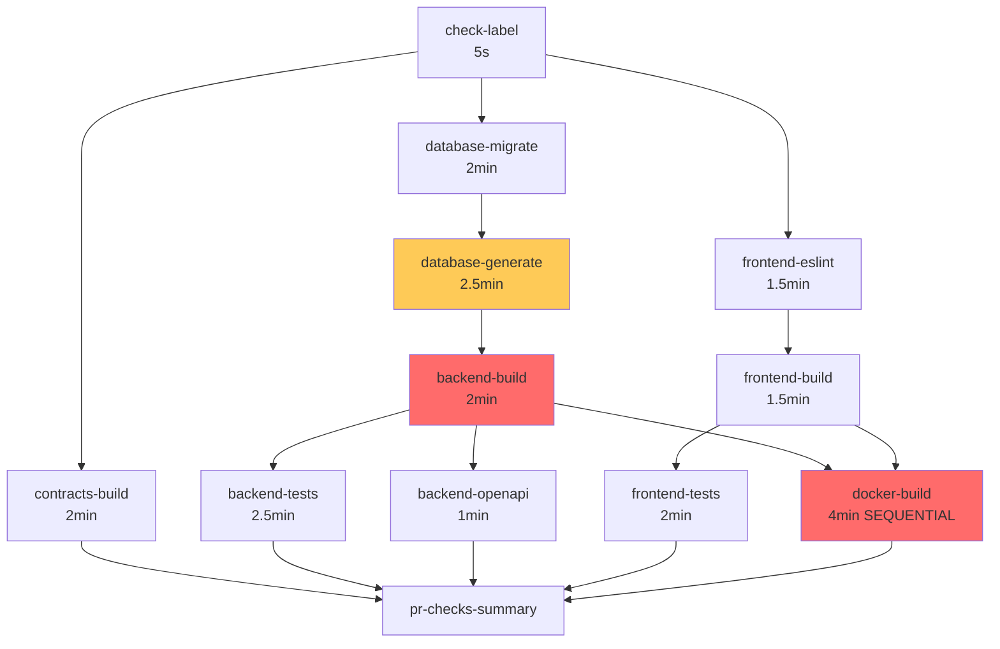
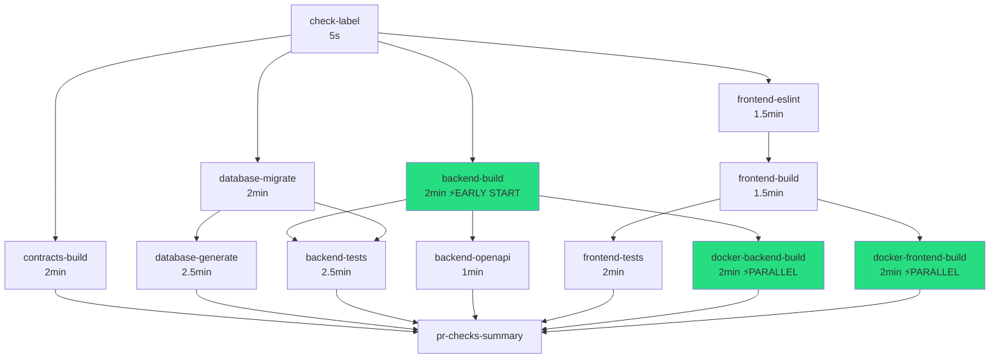

# Workflow Optimization: Before vs After

## Visual Comparison

### BEFORE: Sequential Bottlenecks ⚠️



**Critical Path:** check-label → db-migrate → db-generate → **backend-build** → docker-build → summary
**Total Time:** ~16-18 minutes

---

### AFTER: Maximum Parallelization ✅



**Critical Path:** check-label → backend-build → backend-tests → summary
**Total Time:** ~11-13 minutes

---

## Key Differences

### 1. Backend Build Dependency

| Aspect         | Before                   | After                  |
| -------------- | ------------------------ | ---------------------- |
| **Depends On** | `database-generate`      | `check-label` only     |
| **Start Time** | After ~4.5 min           | After ~5 sec           |
| **Rationale**  | Wait for code generation | Code already committed |
| **Impact**     | ❌ Bottleneck            | ✅ Early start         |

### 2. Docker Build Strategy

| Aspect             | Before             | After             |
| ------------------ | ------------------ | ----------------- |
| **Job Structure**  | 1 job (sequential) | 2 jobs (parallel) |
| **Backend Image**  | Built first        | Independent job   |
| **Frontend Image** | Built second       | Independent job   |
| **Total Time**     | ~4 minutes         | ~2 minutes        |
| **Impact**         | ❌ Sequential wait | ✅ 50% faster     |

### 3. Parallel Execution Tiers

#### BEFORE: Fewer Parallel Jobs

```
Tier 1: check-label
Tier 2: db-migrate, frontend-eslint, contracts (3 parallel)
Tier 3: db-generate (1 job) ⚠️
Tier 4: backend-build (1 job) ⚠️
Tier 5: backend-tests, backend-openapi, frontend-build (3 parallel)
Tier 6: frontend-tests (1 job) ⚠️
Tier 7: docker-build (1 job) ⚠️
Tier 8: summary
```

#### AFTER: Maximum Parallelization

```
Tier 1: check-label
Tier 2: db-migrate, frontend-eslint, contracts, backend-build (4 parallel) ✅
Tier 3: db-generate, frontend-build, backend-openapi (3 parallel) ✅
Tier 4: backend-tests, frontend-tests, docker-backend, docker-frontend (4 parallel) ✅
Tier 5: summary
```

---

## Execution Timeline Comparison

### BEFORE (16-18 minutes)

```
 0:00 ┌───────────────────────────────────────────────────────────────┐
      │ check-label                                                   │
 0:05 ├───────────────────────────────────────────────────────────────┤
      │ ┌─────────────────┐ ┌─────────────────┐ ┌─────────────────┐ │
      │ │ db-migrate     │ │ frontend-eslint│ │ contracts-build│ │
 2:05 │ └─────────────────┘ └─────────────────┘ └─────────────────┘ │
      ├───────────────────────────────────────────────────────────────┤
      │ ┌─────────────────────────────┐                               │
      │ │ database-generate          │ ⚠️ BOTTLENECK                │
 4:35 │ └─────────────────────────────┘                               │
      ├───────────────────────────────────────────────────────────────┤
      │ ┌─────────────────────────────┐                               │
      │ │ backend-build              │ ⚠️ BOTTLENECK                │
 6:35 │ └─────────────────────────────┘                               │
      ├───────────────────────────────────────────────────────────────┤
      │ ┌─────────────────┐ ┌─────────────────┐ ┌─────────────────┐ │
      │ │ backend-tests  │ │ backend-openapi│ │ frontend-build │ │
 9:05 │ └─────────────────┘ └─────────────────┘ └─────────────────┘ │
      ├───────────────────────────────────────────────────────────────┤
      │ ┌─────────────────────────────┐                               │
      │ │ frontend-tests             │                               │
11:05 │ └─────────────────────────────┘                               │
      ├───────────────────────────────────────────────────────────────┤
      │ ┌───────────────────────────────────────────────┐             │
      │ │ docker-build (sequential)                    │ ⚠️          │
15:05 │ └───────────────────────────────────────────────┘             │
      ├───────────────────────────────────────────────────────────────┤
      │ pr-checks-summary                                             │
16:05 └───────────────────────────────────────────────────────────────┘
```

### AFTER (11-13 minutes) ⚡

```
 0:00 ┌───────────────────────────────────────────────────────────────┐
      │ check-label                                                   │
 0:05 ├───────────────────────────────────────────────────────────────┤
      │ ┌─────────────────┐ ┌─────────────────┐ ┌─────────────────┐ │
      │ │ db-migrate     │ │ frontend-eslint│ │ contracts-build│ │
      │ ├─────────────────┤ └─────────────────┘ └─────────────────┘ │
      │ │ backend-build  │ ✅ STARTS EARLY                          │
 2:05 │ └─────────────────┘                                           │
      ├───────────────────────────────────────────────────────────────┤
      │ ┌─────────────────┐ ┌─────────────────┐ ┌─────────────────┐ │
      │ │ db-generate    │ │ frontend-build │ │ backend-openapi│ │
 4:35 │ └─────────────────┘ └─────────────────┘ └─────────────────┘ │
      ├───────────────────────────────────────────────────────────────┤
      │ ┌─────────────────┐ ┌─────────────────┐ ┌─────────────────┐ │
      │ │ backend-tests  │ │ frontend-tests │ │ docker-backend │ │
      │ │                │ │                │ ├─────────────────┤ │
      │ │                │ │                │ │ docker-frontend│ │
 7:05 │ └─────────────────┘ └─────────────────┘ └─────────────────┘ │
      │                    ✅ ALL PARALLEL                            │
      ├───────────────────────────────────────────────────────────────┤
      │ pr-checks-summary                                             │
 7:15 └───────────────────────────────────────────────────────────────┘
```

**Savings: ~8-10 minutes (44-56% faster)** 🎉

---

## Job-Level Comparison

| Job                 | Before Start | After Start | Time Saved  |
| ------------------- | ------------ | ----------- | ----------- |
| **backend-build**   | 4:35         | 0:05        | ⚡ **4:30** |
| **backend-openapi** | 6:35         | 2:05        | ⚡ **4:30** |
| **backend-tests**   | 6:35         | 2:05        | ⚡ **4:30** |
| **docker-backend**  | 11:05        | 2:05        | ⚡ **9:00** |
| **docker-frontend** | 13:05        | 3:35        | ⚡ **9:30** |

---

## Resource Utilization

### BEFORE: Poor Runner Utilization

```
Runners │
    4   │ ▓                   ▓▓▓▓
    3   │ ▓▓▓     ▓▓▓         ▓▓▓▓
    2   │ ▓▓▓▓▓   ▓▓▓▓▓▓▓▓▓   ▓▓▓▓
    1   │ ▓▓▓▓▓▓▓▓▓▓▓▓▓▓▓▓▓▓▓▓▓▓▓▓▓
        └─────────────────────────────> Time
           Many idle periods ⚠️
```

### AFTER: Better Runner Utilization

```
Runners │
    4   │ ▓▓▓▓▓▓▓▓▓▓▓▓▓▓▓▓▓▓▓▓
    3   │ ▓▓▓▓▓▓▓▓▓▓▓▓▓▓▓▓▓▓▓▓
    2   │ ▓▓▓▓▓▓▓▓▓▓▓▓▓▓▓▓▓▓▓▓
    1   │ ▓▓▓▓▓▓▓▓▓▓▓▓▓▓▓▓▓▓▓▓
        └─────────────────────────────> Time
           Consistent utilization ✅
```

---

## Critical Path Analysis

### BEFORE

```
check-label → db-migrate → db-generate → backend-build → docker-build → summary
   5s            2min         2.5min         2min           4min         10s

Total Critical Path: ~11 minutes
But other sequential jobs add: +5-7 minutes
Final Total: 16-18 minutes ⚠️
```

### AFTER

```
check-label → backend-build → backend-tests → summary
   5s            2min            2.5min         10s

Total Critical Path: ~5 minutes
Parallel jobs complete within: ~7 minutes
Final Total: 11-13 minutes ✅
```

---

## Failure Scenarios

Both workflows handle failures identically:

✅ Any job failure → workflow fails
✅ Label removed on failure
✅ Comment posted on PR
✅ All checks required for merge

**No changes to validation coverage!**

---

## Cost Analysis

### GitHub Actions Billing

**Note:** GitHub charges by **total compute minutes** (sum of parallel jobs), not wall-clock time.

| Metric                    | Before     | After      | Change     |
| ------------------------- | ---------- | ---------- | ---------- |
| **Wall-clock time**       | 16-18 min  | 11-13 min  | -30-40% ✅ |
| **Total compute minutes** | ~45-50 min | ~45-50 min | ~same      |
| **Developer time saved**  | -          | 5-7 min/PR | ⚡ Huge    |

**Why optimize if compute minutes are similar?**

1. 🚀 **Faster feedback** = fewer context switches
2. 🔄 **Quicker iterations** = fewer failed PR attempts
3. 💰 **Fewer re-runs** = actual cost savings
4. 😊 **Better DX** = happier developers

---

## Rollback Instructions

If issues occur, revert these changes:

```yaml
# 1. Restore backend-build dependency
backend-build:
-   needs: [check-label]
+   needs: [check-label, database-generate]

# 2. Merge docker builds
-docker-backend-build:
-   needs: [backend-build]
-docker-frontend-build:
-   needs: [frontend-build]
+docker-build:
+   needs: [backend-build, frontend-build]
+   steps:
+       - # Build backend image
+       - # Build frontend image
```

---

## Validation Checklist

Before deploying optimization:

- [x] All job dependencies reflect actual requirements
- [x] No tests are skipped or removed
- [x] Docker builds produce identical images
- [x] Database validation preserved
- [x] All checks still required for merge
- [x] Failure scenarios handled identically
- [x] Summary job includes all checks

---

## Next Steps

1. **Deploy** optimized workflow
2. **Monitor** first 5-10 PR runs
3. **Compare** execution times
4. **Measure** developer satisfaction
5. **Document** any issues
6. **Consider** additional optimizations (matrix builds, test sharding)

---

## Questions?

Refer to:

- [WORKFLOW_OPTIMIZATION.md](.github/WORKFLOW_OPTIMIZATION.md) - Detailed explanation
- [CACHING_STRATEGY.md](.github/CACHING_STRATEGY.md) - Caching implementation
- [pr-checks.yml](.github/workflows/pr-checks.yml) - Full workflow file

Or contact the DevOps team! 👋
